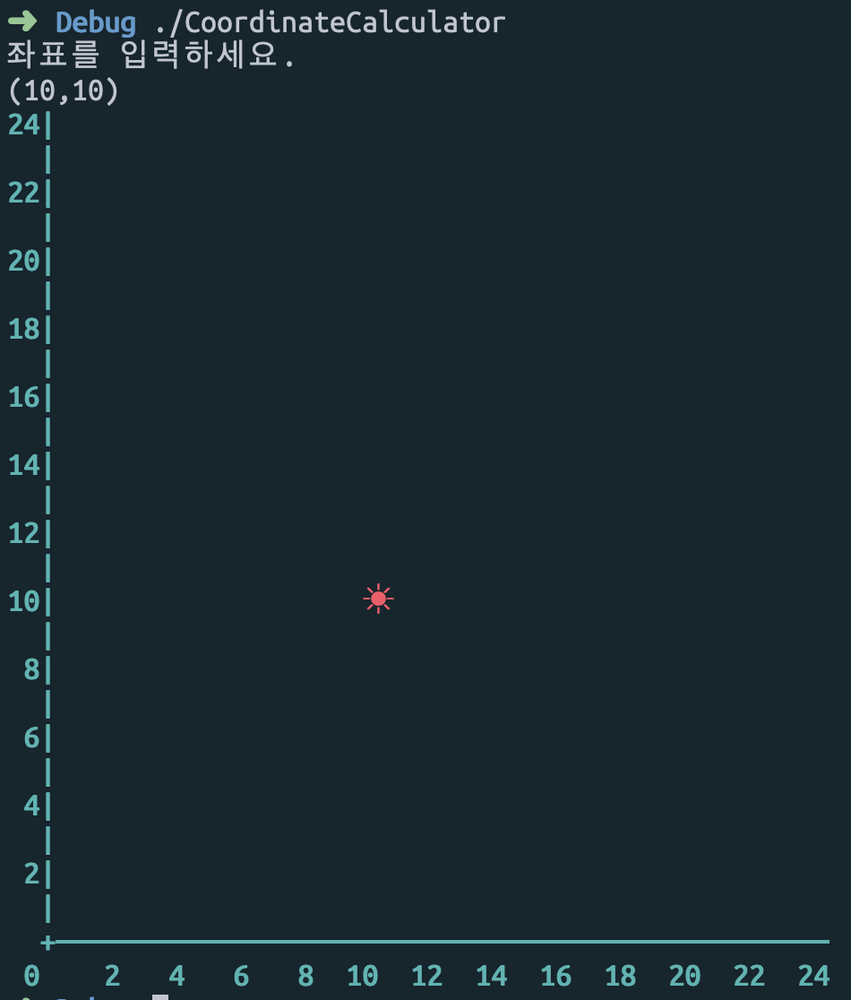
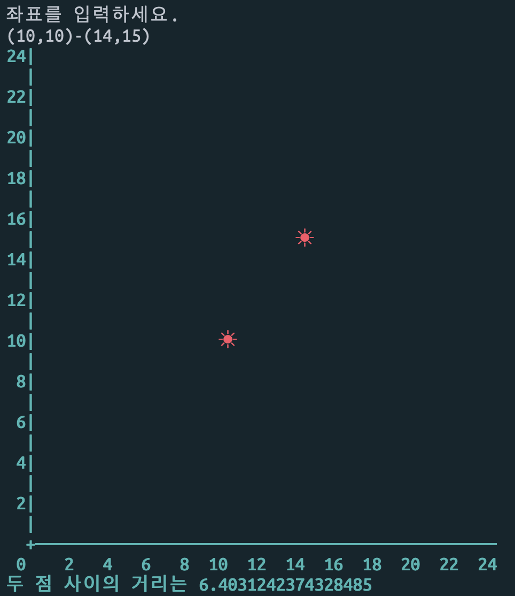
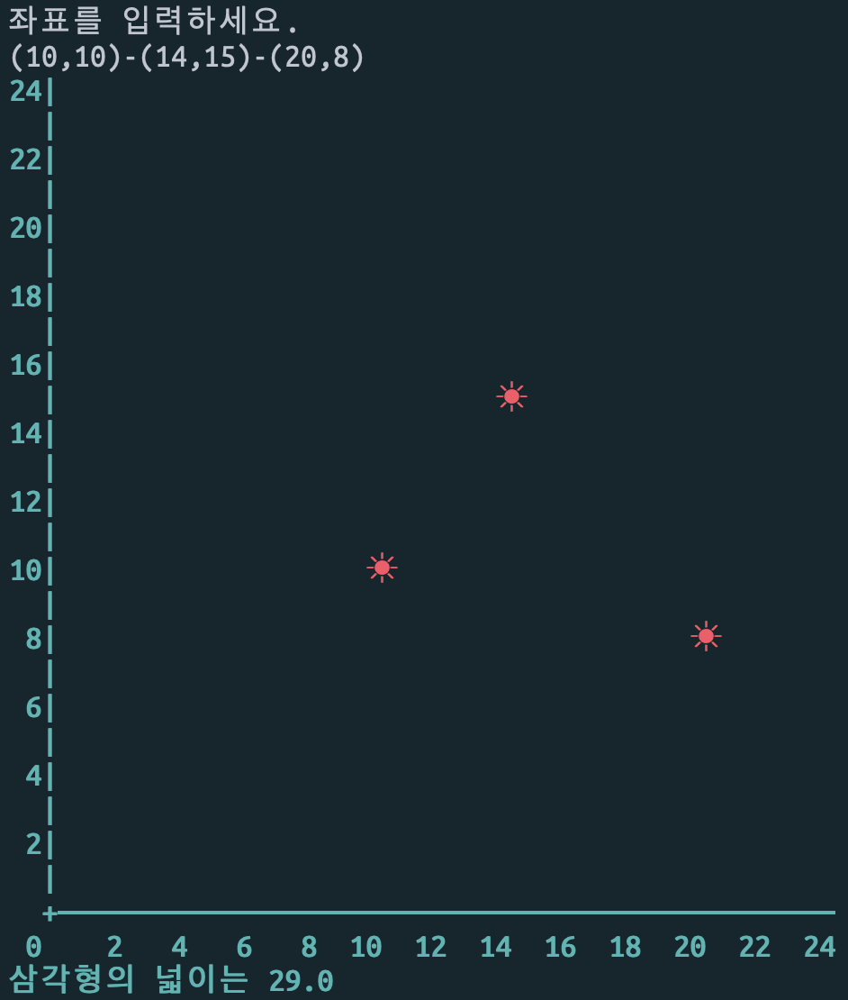
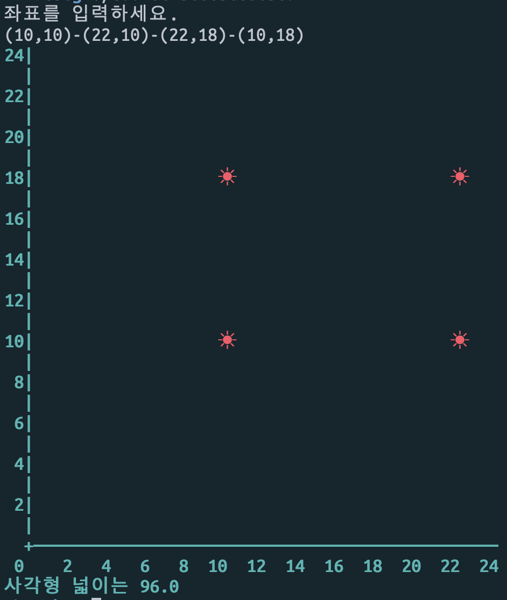
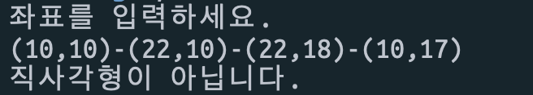

# 좌표계산기

- 터미널 환경기반의 좌표계산기를 작성한다.
- 프로그램을 실행하면 좌표를 입력받는다.
- 좌표 정보는 괄호"(", ")"로 둘러쌓여 있으며 쉼표(,)로 x값과 y값을 구분한다.
- X, Y좌표 모두 최대 24까지만 입력할 수 있다.
- 입력한 좌표에 대해 유효성 검사를 할 수 있다.
- 좌표는 점, 직선, 삼각형, 직사각형의 좌표를 입력할 수 있고 입력 좌표의 갯수에 따라 프로그램이 자동으로 어떤 도형인지 판단한다.
- 입력받은 좌표를 화면에 좌표를 표시하고, 직선이면 두 점 사이의 거리를, 삼각형과 사각형의 좌표는 넓이를 계산해서 알려준다.
- 잘못된 좌표입력의 경우 좌표에 갯수에 따라서 잘못된 좌표임을 알려주고 다시 입력을 받는다.
- 각 객체의 역할과 책임을 구분하도록 노력해 본다
- 메소드가 너무 많은 일을 하지 않도록 분리하기 위해 노력해 본다.
- Unit Test를 작성한다.

## 결과화면

## 주요 경험
- 객체가 하나의 역할과 책임을 갖도록 설계하기
- 객체를 추상화하기
- 내부 프로퍼티는 항상 private으로 감추기
- SOLID 원칙 경험
	- 의존성 역전
	- 새로운 요구사항이나 변경사항에 대해서 변경이 많아지는 구조 지양하기
	- 유지보수에 대해 유리한 설계구조 갖도록 하기
	- 특히, 특정 클래스나 구조체 타입에 의존하지 않도록 하기 위해 protocol을 사용하고 protocol도 역할을 나누어 사용(프로토콜의 분리)
	- 프로토콜 합성을 위해 __protocol composition__ 을 사용하여 처리
- Double타입의 제곱을 정의하는 커스텀 operator 구현
- Swift 문자열 패턴 처리를 위해 정규식표현 사용(NSRegularExpression 클래스 사용)
- 커스텀 에러 타입을 정의하고 에러 케이스에 따른 에러처리
- 서브스크립트
- 커스텀 Factory 객체 만들기

# 코드리뷰 피드백에 대한 개선사항
- 변하지 않는 값에 대해서는 var보다는 let을 사용
- 입력되는 부분의 반복되는 이 부분을 담당하는 입력함수가 재사용될 수 있도록 작성하기
- 테스트 함수는 구체적으로 작성하기
- 강제 언래핑은 지양하기
